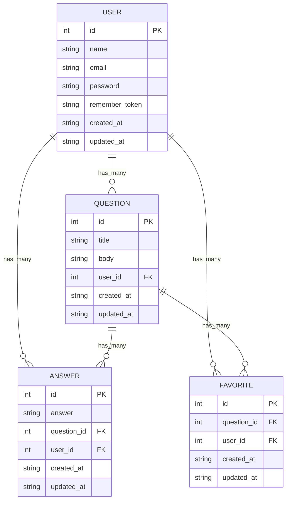

```mermaid

	erDiagram
		direction TB
		USER {
			int id  "PK"  
			string name
			string email
			string password
			string remember_token
			string created_at
			string updated_at
		}

		QUESTION {
			int id "PK"
			string title
			string body
			int user_id "FK"
			string created_at
			string updated_at
		}

		ANSWER {
			int id "PK"
			string answer
			int question_id "FK"
			int user_id "FK"
			string created_at
			string updated_at
		}

		FAVORITE {
			int id "PK"
			int question_id "FK"
			int user_id "FK"
			string created_at
			string updated_at
		}

		USER ||--o{ QUESTION : has_many
		USER ||--o{ ANSWER : has_many
		USER ||--o{ FAVORITE : has_many

		QUESTION ||--o{ ANSWER : has_many
		QUESTION ||--o{ FAVORITE : has_many
```